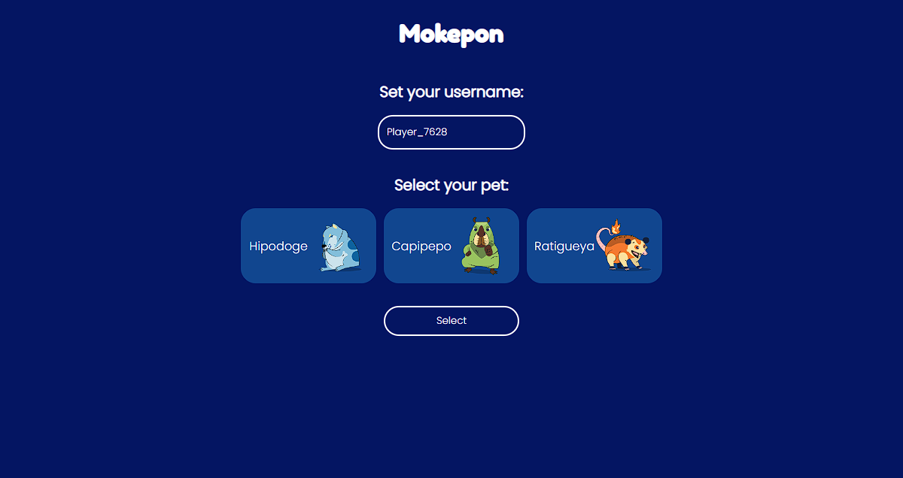

# PlatziChallenge: Mokepon

## NOTA

Si deseas jugar contra ti mismo necesitaras abrir la pagina en dos navegadores diferentes

### Instalación

```
npm install
```

### Ejecución

```
node index.js
```

### Probar

- localhost:3050

## Resumen

### El reto

Users should be able to:

- Play versus others players

### Captura de pantalla



## Mi proceso

### Hecho con

- HTML5
- CSS
- Flexbox
- Mobile-first
- JS Vanilla
- ExpressJS

## Autores

- Hecho con 💚 por  [@crisvegadev](https://www.github.com/crisvegadev)


## Licencia

[MIT](https://choosealicense.com/licenses/mit/)